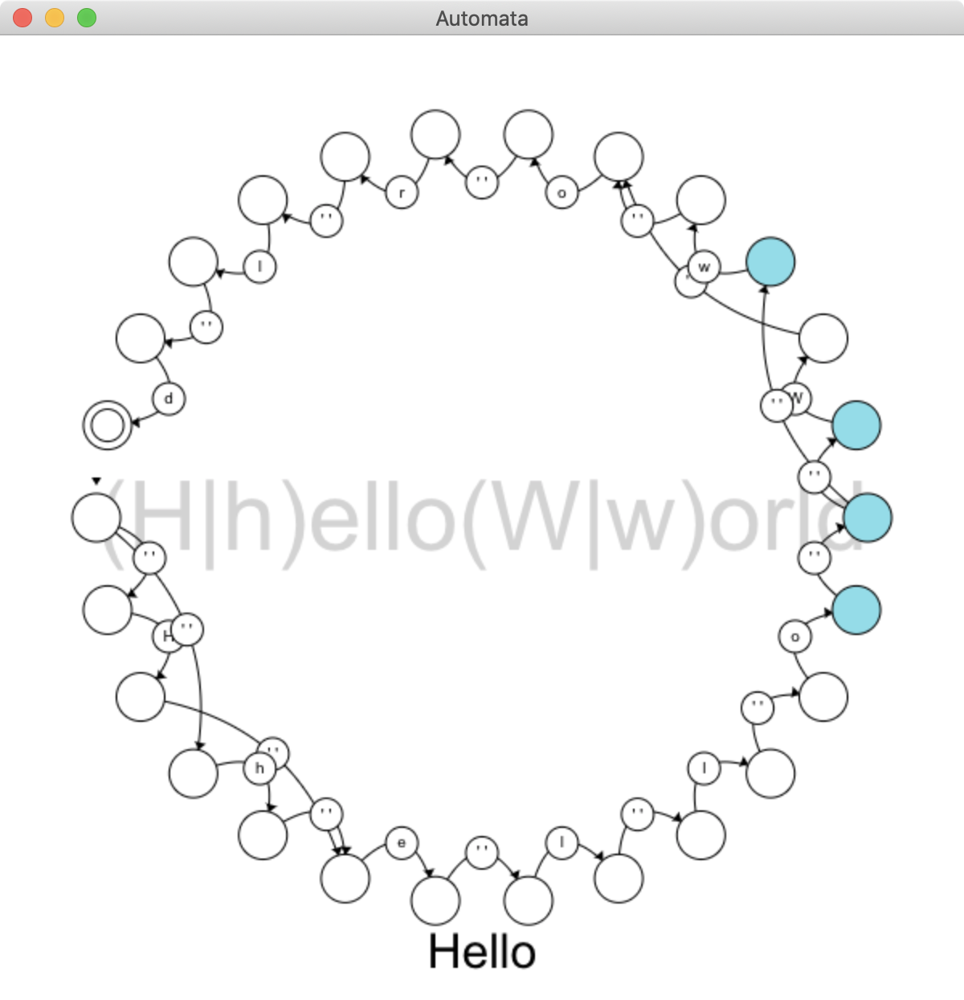

Automata Study
==
This project is for studying automata theory!

Finite Automata
--
- **empty string** : `()` denotes the set contaning *empty string*.
- **literal character** : `a` denotes the set { "a" }.
- **wildcard** : `.` denotes the set of *alphanumeric*.

For given regular expressions R and S,

- **concatenation** : `RS` denotes the set of string that can be obtained by concatenating a string in R and a string in S.
	- `ab` denotes the set { "ab" }.
- **union** : `R|S` denotes the union of R and S.
	- `a|b` denotes the set { "a", "b" }.
- **Kleene star** : `R*` denotes the smallest superset of the set described by R that contains ε and is closed under string concatenation.
	- `(0|1)*` denotes the set { "", "0", "1", "00", "01", ... }

Type a regular expression and press `Enter` to generate a NFA that accepts the expression.

> This NFA accepts "helloworld", "Helloworld", "helloWorld" or "HelloWorld" !  